# Git + Playground Workflow — Team Onboarding

**This document is the presentation.** No other slides or media. Use it as your deck and script.

**Duration:** ~20–25 min

---

# Slide 1 — Welcome

## We're standardizing how we work in the dev repo

By the end of this you will know:

- **Where** we work (one repo, one branch)
- **How** we push without overwriting each other
- **What** to run when you want to push or when you get errors

---

# Slide 2 — The big picture

## Two repos, two roles

```mermaid
flowchart LR
  subgraph Playground["🟢 PLAYGROUND"]
    A[actionit-dev]
  end
  subgraph Production["🔴 PRODUCTION"]
    B[axnt-dev-workspace]
  end
  Team[("👥 All engineers")]
  CTO[("👤 CTO / designated")]
  Team -->|"push daily"| A
  A -->|"promote when validated"| B
  CTO -->|"push after validation"| B
```



| Repo | Role | Who pushes |
|------|------|------------|
| **actionit-dev** | 🟢 Playground | All of us |
| **axnt-dev-workspace** | 🔴 Production | CTO after validation |

**You only work in actionit-dev.** Production is updated only when we promote validated code.

---

# Slide 3 — Where you work (playground)

## One repo, one branch, one remote


| What | Value |
|------|--------|
| **Repo** | actionit-dev (playground) |
| **Remote** | `origin` |
| **Branch** | `dev-workspace` |

**Daily work:** Clone actionit-dev, work on `dev-workspace`, push to **origin dev-workspace**. We do **not** push to axnt-dev-workspace from normal dev work.

---

# Slide 4 — Why we don't overwrite each other

## Git merges commits; it doesn't overwrite file-by-file


- **Pull before you push** → you get others' latest commits.
- **Push rejected?** → Pull, then push again.
- **Different files** → Git combines both automatically.
- **Same file, same lines** → Git asks you to resolve a conflict once.

### What “resolve a conflict” actually means (and how to do it in a hybrid team)

**You don’t log in to Git to see the differences.** When Git can’t merge the same lines automatically, it does three things:

1. **Terminal:** After `git pull`, the terminal will say something like `CONFLICT (content): Merge conflict in <filename>` and list the conflicted files. It does **not** show the full diff in the terminal—it just tells you which files have conflicts.
2. **In the file:** Git writes **conflict markers** directly into the file and leaves both versions in place so you can see them. You open the file in your **editor** (Cursor, VS Code, etc.) and you’ll see something like:
   ```
   <<<<<<< HEAD
   your version of the lines
   =======
   their version of the lines
   >>>>>>> origin/dev-workspace
   ```
   Your editor often highlights these regions and may show buttons like **Accept Current Change**, **Accept Incoming Change**, or **Accept Both**.
3. **Resolving:** You edit the file to keep what should stay (yours, theirs, or a combination), **delete the conflict markers** (`<<<<<<<`, `=======`, `>>>>>>>`), save, then `git add <filename>`, commit, and push.

**Most effective way for two team members (hybrid) to resolve it:**

- **Option A — One person resolves (simplest):** The person who got the conflict (usually the one who pulled second) opens the file in Cursor/VS Code, uses the editor’s “Accept Current / Incoming / Both” or manually edits to the correct result, saves, commits, and pushes. The other person later runs `./scripts/pull-latest.sh` and gets the resolved version. No need to be in the same room or on a call.
- **Option B — Quick alignment then resolve:** If it’s a non-obvious choice (e.g. two different implementations), a short message (Slack, etc.): “Conflict in `Dashboard.tsx` around the header—I’ll keep both: your title, my styling. Resolving and pushing.” Then that person resolves as in Option A. The other just pulls and continues.
- **Option C — Screen-share or pair:** For a tricky or high-stakes conflict, hop on a short call; one person shares their screen, both look at the same conflict blocks in the editor and decide line by line, then one commits and pushes.

You do **not** need to log in to GitHub in the browser to resolve. Everything you need is in your local clone and your editor; the terminal only tells you *which* files to open.

---

# Slide 5 — The one rule

## Pull before push

```mermaid
flowchart LR
  A[Start work] --> B[Pull]
  B --> C[Code]
  C --> D[Commit]
  D --> E[Push]
  E --> F{Done?}
  F -->|Rejected| B
  F -->|OK| G[✅]
```



**If your push is rejected:** run the pull script (or `git pull origin dev-workspace`), fix any conflicts if Git says so, then push again.

---

# Slide 6 — Daily workflow

## Before work → Code → Push


1. **Before work:** `./scripts/pull-latest.sh` (or `git pull origin dev-workspace`).
2. **Work** in your editor.
3. **When you want to push:** `./scripts/push-to-playground.sh`.

---

# Slide 7 — The scripts (no guessing)

## Two scripts, same repo root

| Script | When to use | What it does |
|--------|-------------|--------------|
| **push-to-playground.sh** | When you want to push your changes | Switches to dev-workspace if needed, pulls, shows status, optionally commits, pushes to **origin dev-workspace** |
| **pull-latest.sh** | Before work or when you get errors (e.g. rejected push) | Pulls latest from **origin dev-workspace** so you have the team's changes |

Both assume you're already authenticated (e.g. `gh auth login`) and using the actionit-dev repo. They only talk to **origin** (actionit-dev); they never push to production.

---

# Slide 8 — What the push script does (step by step)

```mermaid
flowchart TB
  A[Run ./scripts/push-to-playground.sh] --> B[On dev-workspace?]
  B -->|No| C[Switch to dev-workspace]
  B -->|Yes| D[Pull from origin]
  C --> D
  D --> E[Show git status]
  E --> F[Uncommitted changes?]
  F -->|Yes| G[Ask: add & commit?]
  G --> H[Push to origin dev-workspace]
  F -->|No| H
  H --> I[✅ Done]
```



- **Safe:** No force-push, no pushing to production. Only **origin dev-workspace** (actionit-dev).

---

# Slide 9 — When you get errors

## Use the pull script first

| Error or situation | What to do |
|--------------------|------------|
| **"Updates were rejected"** | Run `./scripts/pull-latest.sh`, then run `./scripts/push-to-playground.sh` again. |
| **"Merge conflict"** | Open the file(s) Git names, fix the conflict markers (keep or edit both sides), save, `git add <file>`, then run the push script again. |
| **Permission / auth** | Confirm you're a collaborator on actionit-dev and run `gh auth login` (or use your HTTPS token). |

```mermaid
flowchart LR
  Error[❌ Error] --> Pull[Run pull-latest.sh]
  Pull --> Fix[Fix conflicts if any]
  Fix --> Push[Run push-to-playground.sh]
  Push --> OK[✅]
```



---

# Slide 10 — First-time setup

## Clone, branch, auth

```bash
git clone https://github.com/Cyborg-Hawk-AI/actionit-dev.git
cd actionit-dev
git checkout dev-workspace
gh auth login
```

- **Repo link:** https://github.com/Cyborg-Hawk-AI/actionit-dev  
- **Scripts:** `scripts/push-to-playground.sh` and `scripts/pull-latest.sh` (run from repo root).  
- **Quick reference:** `docs/GIT_QUICK_REFERENCE.md`  
- **Full strategy:** `docs/GIT_AND_CICD_STRATEGY.md`

---

# Slide 11 — Recap

## One place, one branch, one rule, two scripts

| | |
|--|--|
| **Playground** | actionit-dev (remote **origin**) |
| **Branch** | dev-workspace |
| **Rule** | Pull before push |
| **Push** | `./scripts/push-to-playground.sh` |
| **Pull / errors** | `./scripts/pull-latest.sh` |

We work only in **actionit-dev** on **dev-workspace**; we push only to **origin**. Production (axnt-dev-workspace) is updated only when the CTO promotes validated code.

---

# Slide 12 — Q&A and wrap

**Common questions:**

- **"Updates were rejected?"** → Run `./scripts/pull-latest.sh`, then push again.
- **"Merge conflict?"** → Open the file, fix the markers, save, `git add` that file, run the push script again.
- **"Can I push without the script?"** → Yes: `git pull origin dev-workspace`, then `git add` / `git commit` / `git push origin dev-workspace`.

**Wrap:** All details and the "why" are in `docs/GIT_AND_CICD_STRATEGY.md` and `docs/GIT_QUICK_REFERENCE.md`. This doc is your presentation; no other supplemental media.

---

## Presenter checklist

- [ ] Add everyone as collaborators to **actionit-dev** (playground).
- [ ] Share repo: https://github.com/Cyborg-Hawk-AI/actionit-dev
- [ ] Point to scripts: `scripts/push-to-playground.sh`, `scripts/pull-latest.sh`
- [ ] Point to quick reference: `docs/GIT_QUICK_REFERENCE.md`
- [ ] Demo: run pull script, then push script, and walk through the output.
