# Team setup, tools, and communication

**Goal:** Work independently but together—clear communication, deliverables, and effectiveness.  
**Stack:** Google Workspace, Jira, shared Google Drive, EC2 dev studios (Cursor), Git (actionit-dev / axnt-dev-workspace).

Keep this doc updated as we add Jira workflows, MFA rollout, and any changes to EC2 or access.

---

## Documentation standards (all team docs)

**All team documentation should be presentation-style:** include **media, graphics, charts, and diagrams** where they help. Use Mermaid for flowcharts and diagrams (renders in GitHub and many editors). It’s fine to ask Cursor to generate or refine these. The onboarding presentation in this repo is the model: slide-like sections, tables, and Mermaid diagrams.

---

## At a glance

```mermaid
flowchart TB
  subgraph Tools["🛠 Tools"]
    GW[Google Workspace]
    Jira[Jira]
    Drive[Shared Drive]
    EC2[EC2 + Cursor]
    Git[actionit-dev Git]
  end
  subgraph Docs["📄 Docs"]
    Backend["backend/docs"]
    Onboarding["Onboarding repo"]
  end
  Team[("👥 Team")]
  Team --> GW
  Team --> Jira
  Team --> Drive
  Team --> EC2
  Team --> Git
  Team -->|"document as you build"| Backend
  Onboarding --> Team
```

---

## 1. Google Workspace and communication

### Email and identity

- **Sign in to Action.IT (Google) on your phone** so you’re reachable and can use work identity on the go.
- Use your **@actionit** (or company) Google account consistently for work email, Chat, and Drive.

### Google Chat

- **Download Google Chat on your phone** for team messaging and quick coordination.
- Use Chat for day-to-day coordination, blockers, and “I’m resolving the conflict in X”–style updates so hybrid work stays in sync.

### Google Drive

- We use a **shared Google Drive** for documents (designs, specs, runbooks, etc.).
- Keep shared project docs and deliverables in agreed folders so everyone can work from the same source of truth.

### Security (MFA)

- **Preemptively install Google Authenticator** (or another TOTP app) on your phone. We will be **enabling MFA on AWS accounts** shortly; you’ll need it to sign in to the AWS console and for any AWS CLI/SSO that uses MFA.

---

## 2. Jira — documenting and tracking work

- We use **Jira** to document and track work (tasks, bugs, stories).
- **How to work with Jira** will be walked through in a session later; this section will be updated with:
  - How we create/assign tasks
  - How we link work to branches/commits (if applicable)
  - Our board(s) and workflow (e.g. To Do → In Progress → Done)
  - Any team conventions (labels, sprints, etc.)

*Progress: to be updated after the Jira walkthrough.*

---

## 3. Development — EC2 dev studios (Cursor)

Development is done on **shared EC2 instances** that run **Cursor**. Your laptop stays light; the VM bears the load. Each dev studio is already configured with the repo and you have your own user on the VM.

### EC2 assignment (2 people per EC2)

| EC2 | Use | Members |
|-----|-----|---------|
| **DevOps EC2** | DevOps work | Paul, Eugene |
| **UX/CX EC2** | UX/CX work | Andrew, Asma |

- **Git posture is critical.** We maintain the same Git workflow (playground = actionit-dev, one branch, pull before push, push/pull scripts). Use the scripts and docs in this Onboarding repo on the EC2 as well.

### Starting and stopping your EC2

```mermaid
flowchart LR
  Start([Start work]) --> Run["Run start script"]
  Run --> RDP["RDP from Mac"]
  RDP --> Cursor["Work in Cursor"]
  Cursor --> Save["Save / commit / push often"]
  Save --> Stop["Stop script or VM shutdown"]
  Stop --> End([Done])
  Auto["⏱ Auto-shutdown every 2h"] -.-> Save
```

- You will be given a **start script** to bring your EC2 instance up when you begin work.
- **Auto-shutdown:** EC2 instances **automatically shut down every 2 hours** for cost control. We may add a “delay shutdown” option later; for now assume a 2‑hour window.
- **Be diligent about saving your work:** commit and push to the playground (actionit-dev) regularly so you don’t lose work if the instance shuts down. Use the push script and pull script from this repo.
- To stop the instance yourself:
  - Use the **stop script** you’re provided, or  
  - **Shut down the EC2 from inside the VM** (e.g. Start menu → Shut down).

---

## 4. Accessing your EC2 from a Mac (RDP)

Everyone on the team has a MacBook. You connect to your EC2 dev studio using **Remote Desktop (RDP)**.

### Steps

1. **Download the Windows remote desktop app** from the **Apple App Store** (search for “Microsoft Remote Desktop” or “Windows Remote Desktop”).
2. **Credentials** will be sent to you **individually via encrypted email** (user name and password for your user on the EC2).
3. In the **Windows (RDP) app**, add a new PC/connection and **hard-set (save) your credentials** so you can connect with one tap.
4. Use the connection to **RDP into your assigned EC2** and open Cursor there as your dev workspace.

If you’re on the DevOps EC2, you share that VM with one other person (each with your own Windows user). Same for UX/CX EC2—each person has their own user; the VM is shared.

---

## 5. Documentation as you build (part of the dev process)

**As part of your dev process, create (or ask Cursor to create) dev documentation** for what you build: what it does, how to build it, and how to fix or troubleshoot it when something goes wrong. This applies to new features, services, or any significant change.

### Where it lives

- **Keep all such docs organized under `backend/docs`** in the repo (actionit-dev). Use subfolders or clear filenames if needed (e.g. by feature or service).
- It’s **totally fine to use Cursor** to draft or generate these docs; then edit and commit them like any other change.

### What to include

| What | Why |
|------|-----|
| **What you built** | So others (and future you) understand the feature or service. |
| **How to build / run it** | Steps to build, run, or deploy so someone can reproduce. |
| **How to fix or troubleshoot** | Common failures, errors, and how to resolve them (with graphics or steps if helpful). |

### Format

- Follow the **documentation standards** at the top of this doc: **presentation-style**, with **diagrams, charts, and graphics** where they help (e.g. Mermaid for flows and architecture). This keeps docs scannable and consistent with the rest of our material.

---

## 6. Quick reference

| What | Where / how |
|------|---------------------|
| **Email / identity** | Action.IT (Google) on phone + desktop |
| **Chat** | Google Chat (install on phone) |
| **Docs** | Shared Google Drive |
| **MFA (AWS soon)** | Install Google Authenticator (or TOTP app) now |
| **Work tracking** | Jira (workflow and how-to to be added after walkthrough) |
| **Code / Git** | actionit-dev (playground), branch dev-workspace; push/pull scripts in Onboarding repo |
| **Dev environment** | EC2 + Cursor (start script → RDP from Mac → work in Cursor) |
| **EC2 shutdown** | Auto every 2 hours; save/push often; use stop script or VM shutdown when done |
| **Build documentation** | Create/ask Cursor to create dev docs; keep under **backend/docs**; presentation-style with diagrams |

---

## 7. Keeping this doc updated

- **Jira:** After the Jira session, this doc will be updated with workflow and “how we work with Jira.”
- **MFA:** When AWS MFA is enabled, we’ll add a short “AWS MFA” subsection or link here.
- **EC2:** Any change to start/stop scripts, auto-shutdown, or delay shutdown will be reflected here.

If you notice something missing or outdated, flag it in Chat or to the CTO so we can keep this the single reference for setup, tools, and communication.
